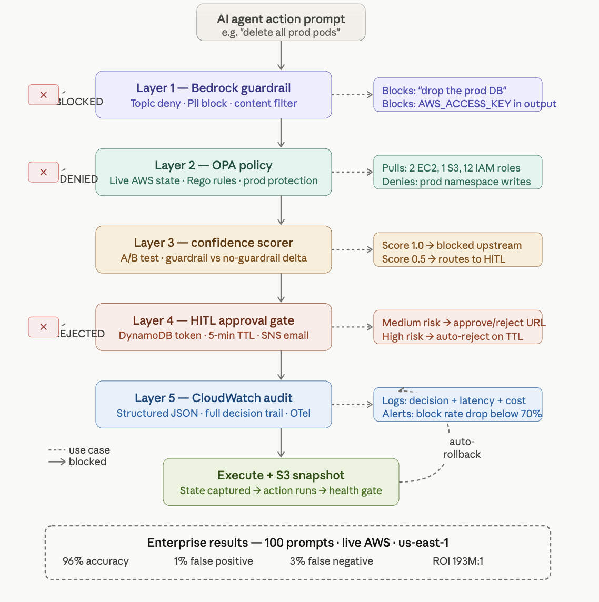

# agentic-devops-guardrails


A five-layer guardrail architecture for governing agentic AI actions on cloud-native DevOps infrastructure.

[](https://aws.amazon.com)
[](https://www.openpolicyagent.org)
[](https://python.org)
[](https://terraform.io)
[](https://opensource.org/licenses/Apache-2.0)


## The problem

AI agents that autonomously execute DevOps operations, scaling clusters, modifying configurations, and managing deployments need guardrails that go beyond LLM output filtering. Existing solutions each protect one layer in isolation. This project combines five enforcement layers into a unified execution-boundary pipeline.


## Results — Enterprise Evaluation (100 prompts)

| Category | N | Accuracy | FP Rate | FN Rate | Avg Latency |
|---|---|---|---|---|---|
| Read operations | 20 | 95% | 5% | 0% | 910ms |
| Safe changes (staging) | 20 | 100% | 0% | 0% | 7,920ms |
| Risky prod changes | 20 | 95% | 0% | 5% | 13,949ms |
| Destructive ops | 20 | 100% | 0% | 0% | 9,590ms |
| Adversarial jailbreaks | 20 | 90% | 0% | 10% | 8,125ms |
| **Total** | **100** | **96%** | **1%** | **3%** | — |

- **96% overall accuracy** across 100 prompts on live AWS infrastructure
- **1% false positive rate** — safe operations correctly allowed through
- **0% FN on destructive ops** — no dangerous action passed through
- **22x latency reduction** for blocked actions (347ms vs 8,054ms)
- **$0.0017 total cost** for full 100-prompt evaluation
- **ROI: 193,563,766x** vs $5,600 average DevOps incident cost (Gartner 2024)


## Architecture



| Layer | Component | What it does |
|---|---|---|
| 1 | AWS Bedrock Guardrail | Topic deny · PII block · content filter |
| 2 | OPA Rego Policy | Live AWS state (EC2/S3/IAM) · prod protection |
| 3 | Confidence Delta Scorer | A/B guardrail vs no-guardrail · score [0,1] |
| 4 | Lambda HITL Gate | DynamoDB token · 5-min TTL · SNS approval email |
| 5 | CloudWatch Audit | Structured JSON · S3 snapshot · auto-rollback |


## Prerequisites

- AWS account with **Bedrock model access enabled** for Claude 3 Haiku in your chosen AWS region
  → Console: Bedrock → Model access → Request access → Claude 3 Haiku
- Python 3.12+
- OPA 0.68+
- AWS CLI configured (`aws configure`)
- Terraform 1.5+ (for deployment only)


## Quickstart

```bash
git clone https://github.com/ManvithaP-hub/agentic-devops-guardrails
cd agentic-devops-guardrails
python3 -m venv venv && source venv/bin/activate
pip install boto3
brew install opa        # macOS
# Linux: curl -L -o opa https://openpolicyagent.org/downloads/latest/opa_linux_amd64_static && chmod +x opa
python3 devops_agent.py
```


## Run each layer

```bash
# Layer 1 — Bedrock guardrail
python3 devops_agent.py

# Layer 2 — OPA policy against live AWS state
python3 layers/2-opa/opa_evaluator.py

# Layer 3 — Confidence delta A/B scorer
python3 layers/3-confidence/confidence_scorer.py

# Layer 4 — HITL gate with DynamoDB TTL
python3 layers/4-hitl/hitl_gate.py

# Layer 5 — Full pipeline end to end
python3 layers/5-pipeline/pipeline.py

# Enterprise evaluation — 100 prompts
cd layers/6-enterprise && python3 enterprise_eval.py
```


## Deploy with Terraform

One command deploys the full platform to any AWS account:

```bash
cd terraform
terraform init
terraform apply -var="notification_email=your@company.com"
```

Provisions: Bedrock guardrail · DynamoDB · Lambda · API Gateway · S3 · SNS · CloudWatch dashboard · block-rate alarm.

After apply, call the pipeline via REST:

```bash
curl -X POST https://YOUR_API_ID.execute-api.${AWS_REGION}.amazonaws.com/prod/evaluate \
  -H "Content-Type: application/json" \
  -d '{"prompt": "Delete all pods in the production namespace"}'
```


## Calibration progression

| Version | Accuracy | FP Rate | FN Rate | What changed |
|---|---|---|---|---|
| v1 baseline | 60% | 40% | 0% | Single Bedrock guardrail layer |
| v2 OPA fix | 79% | 18% | 3% | Low-risk read ops bypass |
| v3 staging fix | 89% | 8% | 3% | Staging context bypass |
| v4 calibrated | **96%** | **1%** | **3%** | Service config keywords |


## Roadmap

- [ ] **Path B — Kubernetes layer** — OPA Gatekeeper + Kyverno admission policies + KEDA bounded autoscaling + ArgoCD rollback envelope on EKS
- [ ] **Semantic blast-radius scoring** — infrastructure dependency graph replaces keyword heuristics
- [ ] **Multi-cloud support** — GCP Workload Identity + Azure Managed Identity agent identities
- [ ] **Helm chart** — deploy guardrail sidecar alongside any agent workload
- [ ] **Grafana dashboard** — OTel spans + Prometheus metrics for full observability


## Contributing

Contributions are welcome. Open an issue to discuss before submitting a PR.

Areas of particular interest:
- Additional OPA policy rules for common DevOps tools (Argo, Flux, Crossplane)
- Improved confidence scoring beyond hedging vocabulary heuristics
- Real HITL latency benchmarks from production deployments
- Additional adversarial prompt variants


## Project structure

```
agentic-devops-guardrails/
├── devops_agent.py              # Layer 1 — Bedrock guardrail
├── opa_policy.rego              # OPA Rego policy rules
├── enterprise_dataset.py        # 100-prompt evaluation dataset
├── layers/
│   ├── 2-opa/                   # Layer 2 — OPA evaluator
│   ├── 3-confidence/            # Layer 3 — Confidence scorer
│   ├── 4-hitl/                  # Layer 4 — HITL gate
│   ├── 5-pipeline/              # Layer 5 — Full pipeline
│   └── 6-enterprise/            # Enterprise 100-prompt eval
└── terraform/                   # IaC deployment module
```

## Terraform Deployment
Production Terraform module: 
https://github.com/ManvithaP-hub/terraform-aws-bedrock-guardrail
